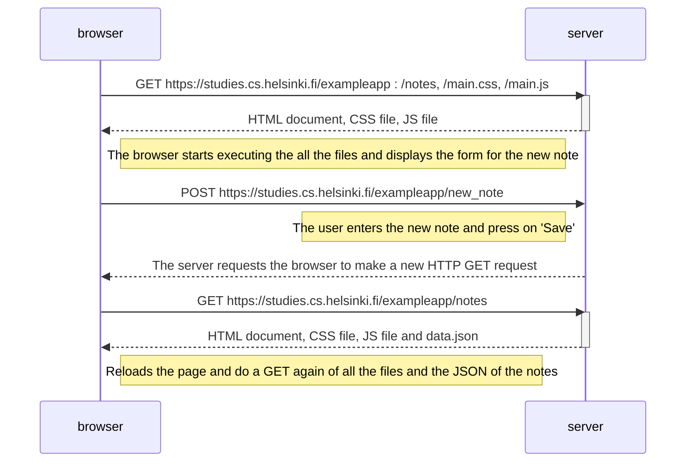

```mermaid
sequenceDiagram
    participant browser
    participant server

    browser->>server: GET https://studies.cs.helsinki.fi/exampleapp : /notes, /main.css, /main.js
    activate server
    server-->>browser: HTML document, CSS file, JS file
    deactivate server

    Note right of browser: The browser starts executing the all the files and displays the form for the new note

    browser->>server: POST https://studies.cs.helsinki.fi/exampleapp/new_note
    Note left of server: The user enters the new note and press on 'Save'
    server-->>browser: The server requests the browser to make a new HTTP GET request
    browser->>server: GET https://studies.cs.helsinki.fi/exampleapp/notes
    activate server
    server-->>browser: HTML document, CSS file, JS file and data.json
    deactivate server

    Note right of browser: Reloads the page and do a GET again of all the files and the JSON of the notes
```
