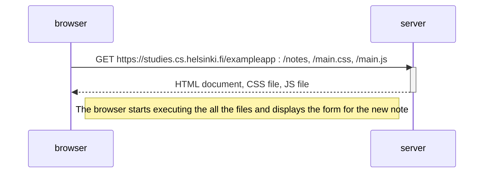

```mermaid
sequenceDiagram
    participant browser
    participant server

    browser->>server: GET https://studies.cs.helsinki.fi/exampleapp : /notes, /main.css, /main.js
    activate server
    server-->>browser: HTML document, CSS file, JS file
    deactivate server

    Note right of browser: The browser starts executing the all the files and displays the form for the new note
```
